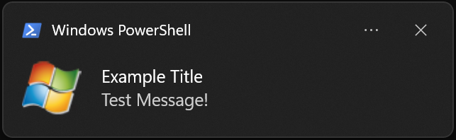

# Toazt - A Windows 10 Toast Notification Module
A lightweight and simple module for displaying toast notifications in Windows 10/11 applications, written entirely in Zig.

## Features
- Native support for Windows 10/11 toast notifications. No dependencies required.
- Full unicode support
- Simplistic syntax for creating and pushing toast notifications (2x commands required)
- Customisable notification properties including: title, message, included icon and show duration (very basic)

## Importing & Building
NOTE: As of Toazt v1.1.0's release, this module is working on Zig version 0.13.0.

To utilise Toazt in your projects, the repo must be saved into your project's build.zig.zon file. Steps on this process are as follows:

1. Fetch the Toazt repo from GitHub using the following command:
```zig
zig fetch --save "https://github.com/rullo24/Toazt/archive/refs/tags/v1.1.0.tar.gz"
```
NOTE: The version flag is determined by the release tag version you're using from GitHub. The version in the example is v1.1.0.

2. Add the Zeys dependency to your build.zig file build process (will be pulled due to zig fetch command in step 1)
```zig
const std = @import("std");

pub fn build(b: *std.Build) void {
    const optimise = b.standardOptimizeOption(.{});
    const target = b.standardTargetOptions(.{});

    const toazt = b.dependency("Toazt", .{
        .target = target,
        .optimize = optimise,
    });

    const exe = b.addExecutable(.{
        .name = "tester",
        .root_source_file = b.path("test_toazt.zig"),
        .optimize = optimise,
        .target = target,
    });

    exe.root_module.addImport("toazt", toazt.module("toazt"));
    b.installArtifact(exe);
}
```

3. Import the Zeys module at the top of your code using the "@import" method
    - See example below

## Usage
Despite the complexity of toast notifications (behind-the-scenes), this module implements a "two-command implementation" concept. This means that all complexity is hidden behind an abstraction layer.

To use Toazt notifications in your code, ensure that the module is correctly imported in your build.zig file (as above) and add the following line to the top of your .zig files:
```bash
const toazt: type = @import("Toazt")
```

### Example
```bash
// std zig includes
const std = @import("std");

// including toazt package
const toazt: type = @import("toazt");

pub fn main() !void {
    // init allocator --> GPA used instead of page_allocator to reduce memory consumption
    var gpa = std.heap.GeneralPurposeAllocator(.{}){};
    const alloc = gpa.allocator();
    defer _ = gpa.deinit();

    // creating test notification
    var test_notification: toazt.Notification = toazt.Notification {
        .title = "Example Title",
        .message = "Test Message! 😁",
        .icon_loc_abs = "C:\\Windows\\IdentityCRL\\WLive48x48.png",
        .duration = toazt.Duration.short,
    };

    // pushing the notification to the Windows screen
    try test_notification.push(alloc);

    return;
}
```


## Thanks
Considering I have never before worked with toast notifications (without use of a module), some inspiration was needed to start this project. I would like to thank *go-toast/toast* and *GitHub30/toast-notification-examples* for their work on toast-related projects. Referenced links can be found here:
- https://github.com/GitHub30/toast-notification-examples
- https://github.com/go-toast/toast?tab=readme-ov-file